# STOCKUP 

## Agenda 
- Goal 
- Data Process
- Exploratory Data Analysis
- Models
- Conclusion

# Project Goal
Have users be able to choose between growth and value stocks to simulate returns to then recommend similar stocks from their choices. Increase the knowledge of a new investor through understanding fundamental analysis for value investing.

# Data Process

## Data Source Available
- Stockpup.com
- Treasury.gov
- Yahoo-Finance.com
- Finviz.com 

## Data Collected 
- 760 Stocks from Stock-Pup dated back to 1990
- Interest Rates from Treasury.gov dated back to 2000
- Market Historical Data from Yahoo dated back to 2000
- Sector and Company from Finviz.

## Data Cleaning and Preparation

### Data Cleaning and Prep For Classification Model:

- Removed the stocks that were not existent.
- Placed Dummy Variables on sectors for categorical variable
- Added to the dataset 1 for good ratio or 0 for bad ratio according to research on investopedia and finance books dependent on P/E ratio, ROE, ROA, etc.

### Data Cleaning and Prep For Clustering Model:

- Placed the average year return from each individual stock.
- Placed the average volatility for each individual stock 
- Took each stock and placed the average sharpe ratio using the treasury interest rate to calculate risk free ratio. 

### Data Prep For Time Series  Monte Carlo Simulation:
- Setup to take in the time-horizon of an investment.
- Setup to return the total risk of the portfolio according to users input. 

# Exploratory Data Analysis

### **Count of Sectors in the dataset.**

**Observation**: 
- We can see we have a fair amount of **Financial and Services** Industries.

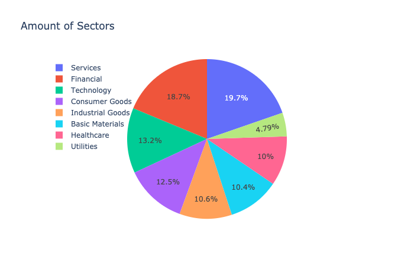

### **Earnings Per Sector**

**Observation**:
- We can see the Financial industry has a considerable amount of profit from 2000-2019 as well as Technology industry

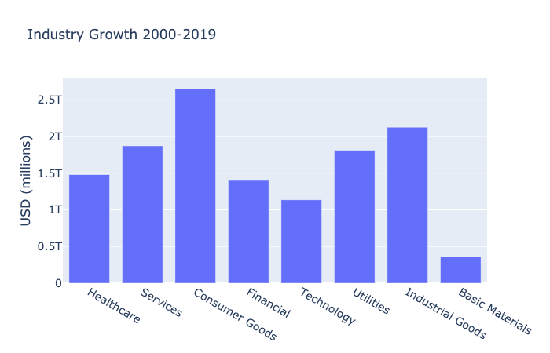

## Closer Look !

**Value Stocks  Earning:**
- The **Financial Industry and Consumer Goods** have been well in favor for the value stocks.

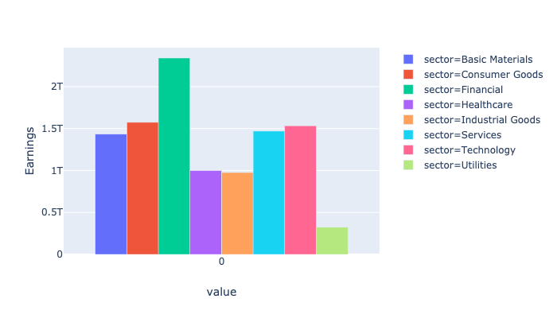

**Growth stock Earnings:**
- The **Technology and Healthcare Industry** have been well in favor for the growth stocks.

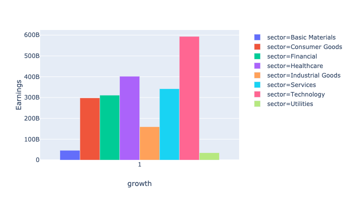

### **Price Per Share Sector**

**Observation:**
- Value Stocks in Finance industry has a considerable amount of profit from 2000-2019 as well as Services
- Growth Stocks in Healthcare and Technology shows profit from 2000-2019

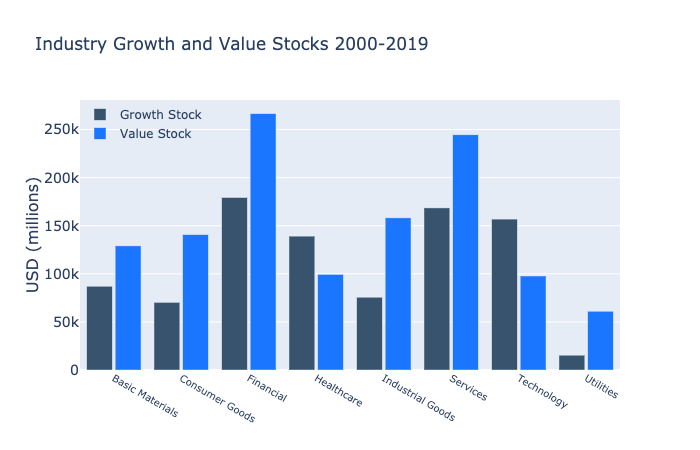

# Model Pipeline

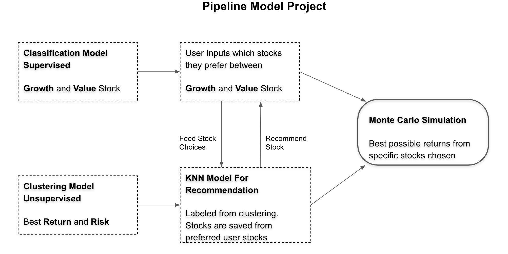

## **Classification Model : Adaboost**

### **Classify Growth and Value Stocks**
----------------
**Observation:**
- Price to Book Ratio shows a major importance in classifying between growth and value stocks.
- Accuracy Score: 91%

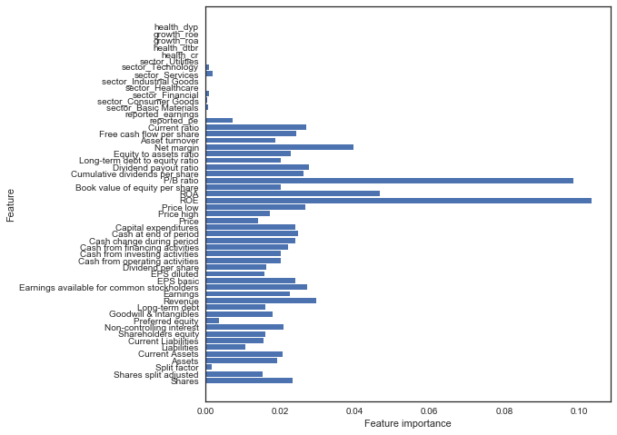 -------

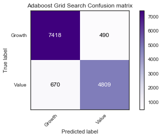

## **Clustering Model : KMeans Clustering**

### **Clustering performance (Fifth Trial)**

--------------------------------
- Clusters = 14
- silhouette score: 0.34
- SSE withing cluster: 251.0

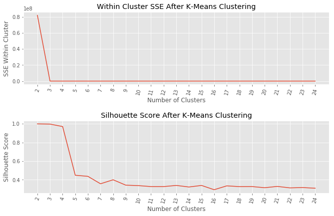

## **Time Series Model : Monte Carlo Simulation**
---
After inputing the price range to invest into stocks and 
time-horizon I was given this outcome.

- Price to Invest per year : $938.93
- Expected return : 0.116
- Risk : 0.43

Possible Return: 
- 5%-ile:   $2,440.82
- 10%-ile:   $3,075.67
- 15%-ile:   $3,665.73

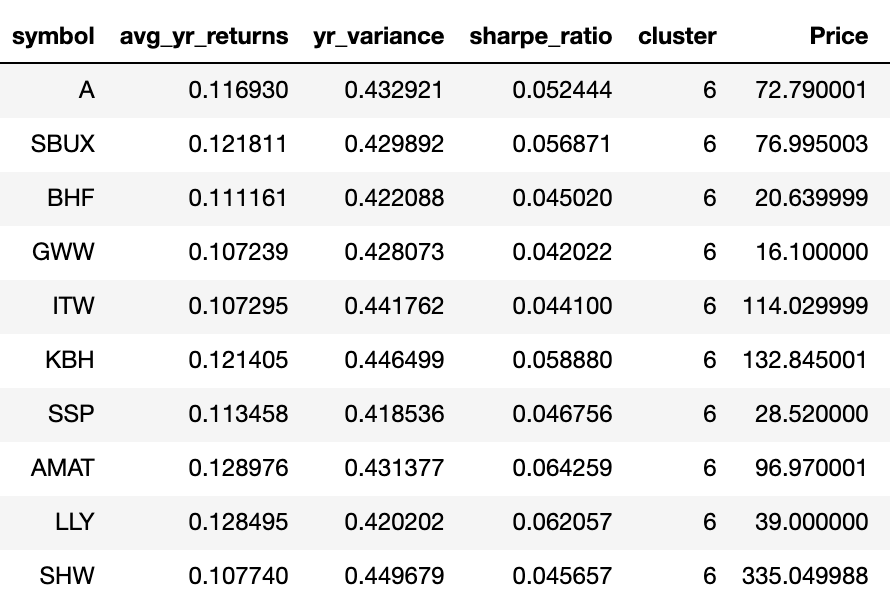
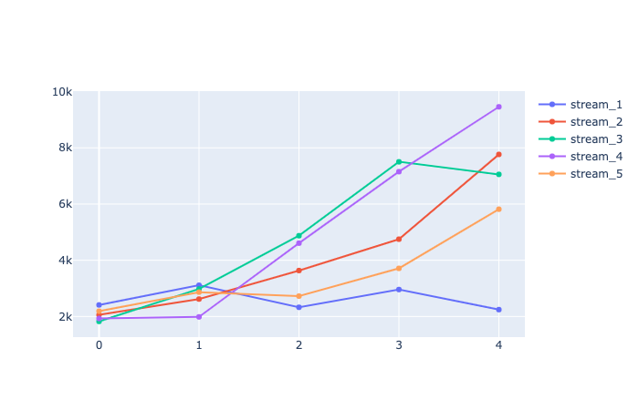

# Conclusion

- The classification model worked very well at depicting value stocks and growth stocks. 
- The clustering model worked well at putting together stocks based on risk and return.

## Further Improvements
- Running a Model for the Health of an industry.
- Have data run live each trading day to keep track
  of price updates.
